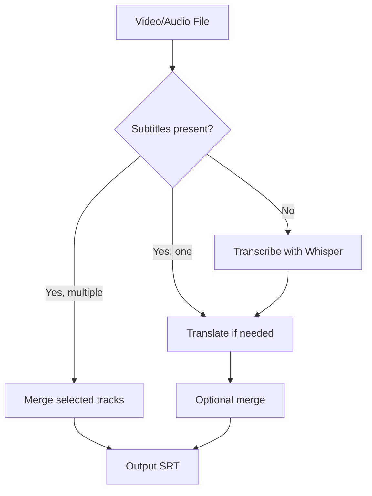

# 🎬 Subtitle Pipeline

A practical subtitle engine for local media: **list, extract, transcribe, translate, and merge** subtitle tracks.

> Scope note: this repo is now **engine-only**. Learning markdown/vocabulary generation is being split into a separate skill.

## Core Workflow



## Features

- Inspect subtitle streams in MKV/MP4/etc.
- Extract subtitle tracks by index or language
- Convert subtitle tracks to SRT
- Transcribe audio/video to SRT via Whisper
- Translate subtitle files with OpenAI-compatible APIs
- Merge tracks using overlap-based alignment

## Prerequisites

- Python 3.9+
- `ffmpeg` + `ffprobe`
- Optional for translate: `openai`, `python-dotenv`
- Optional for transcribe: `whisper` CLI

## Quick Start

```bash
# 1) List subtitle tracks
python scripts/pipeline.py list movie.mkv

# 2) Extract English subtitle track to SRT
python scripts/pipeline.py extract movie.mkv --language eng --to-srt

# 3) Translate SRT to Chinese
python scripts/pipeline.py translate movie.eng.srt --target-language "Chinese"

# 4) Merge English + Chinese tracks from container
python scripts/pipeline.py merge movie.mkv --languages eng chi

# 5) If no subtitles exist, transcribe first
python scripts/pipeline.py transcribe movie.mkv --model turbo
```

## Install as an OpenClaw Skill

```bash
npx skills add https://github.com/mxggle/subtitle-pipeline --skill subtitle-pipeline --agent openclaw --yes
```

Optional (install globally for all projects):

```bash
npx skills add https://github.com/mxggle/subtitle-pipeline --skill subtitle-pipeline --agent openclaw --global --yes
```

## Publish & Discovery Essentials

If you want people to find and use this skill:

1. Keep the repo **public**.
2. Keep `SKILL.md` clean (`name` + clear `description`).
3. Put the install snippet above in the README and share it in communities.
4. Submit to curated skill lists/directories (e.g. skills ecosystem repos) for discovery.

## CLI Commands

### `list`
```bash
python scripts/pipeline.py list <video>
```

### `extract`
```bash
python scripts/pipeline.py extract <video> [--index N | --language CODE] [--to-srt] [--output PATH]
```

### `merge`
```bash
python scripts/pipeline.py merge <video> [--indices N N | --languages CODE CODE] [--output PATH]
```

### `translate`
```bash
python scripts/pipeline.py translate <srt-or-video> --target-language "Chinese" [--api-key ...] [--base-url ...] [--model ...] [--output ...]
```

### `transcribe`
```bash
python scripts/pipeline.py transcribe <video-or-audio> [--model turbo] [--language en] [--output PATH]
```

## Output Convention

- `movie.eng.srt`
- `movie.zho.srt`
- `movie.eng-chi.merged.srt`

## Example Output Files

When testing the skill on a sample video in the `tests/` directory, the following files are naturally generated:

- `The best way to become good at something might surprise you - David Epstein.srt` (generated by transcription)
- `The best way to become good at something might surprise you - David Epstein.chinese.srt` (generated by translation)

## Project Structure

```text
subtitle-pipeline/
├── SKILL.md
├── README.md
├── scripts/
│   └── pipeline.py
├── tests/
│   ├── test_merge.py
│   └── test_translation.py
└── references/
    └── subtitle-notes.md
```

## Development

Run tests:
```bash
python3 -m pytest tests -v
```

## Roadmap

- [x] list / extract / merge
- [x] OpenAI-compatible translation
- [x] Whisper transcription
- [ ] API-backed transcription provider interface (optional backend)
- [ ] Chunked long-video pipeline for reliability

## License

Internal skill / private workflow project.
