# 🎬 Subtitle Learning Lab

Turn video subtitles into language-learning resources. Extract, merge, translate, and study — all from one CLI.

## Skill Workflow

```mermaid
flowchart TD
    A["🎬 Video File"] --> B{"Inspect subtitle\ntracks"}
    B --> C{"How many\nsubtitle tracks?"}

    C -->|"≥ 2 tracks"| D["✅ Merge Tracks\n(bilingual SRT)"]
    C -->|"1 track"| E["⚠️ Translate\n(coming soon)"]
    C -->|"0 tracks"| F["⚠️ Whisper ASR\n(coming soon)"]

    D --> G["📝 Generate\nLearning Markdown"]
    E --> G
    F --> G

    G --> H["📦 Package for Study"]

    H --> I["movie.eng.srt"]
    H --> J["movie.jpn.srt"]
    H --> K["movie.vocab.csv"]
    H --> L["movie.learning.md"]

    style A fill:#4a90d9,stroke:#2c5f8a,color:#fff
    style B fill:#5b6abf,stroke:#3d478a,color:#fff
    style C fill:#7c5cbf,stroke:#553d8a,color:#fff
    style D fill:#27ae60,stroke:#1e8449,color:#fff
    style E fill:#f39c12,stroke:#d68910,color:#fff
    style F fill:#f39c12,stroke:#d68910,color:#fff
    style G fill:#5b6abf,stroke:#3d478a,color:#fff
    style H fill:#4a90d9,stroke:#2c5f8a,color:#fff
    style I fill:#2c3e50,stroke:#1a252f,color:#ecf0f1
    style J fill:#2c3e50,stroke:#1a252f,color:#ecf0f1
    style K fill:#2c3e50,stroke:#1a252f,color:#ecf0f1
    style L fill:#2c3e50,stroke:#1a252f,color:#ecf0f1
```



> ✅ = implemented &nbsp;&nbsp; ⚠️ = planned

## Prerequisites

- **Python 3.9+**
- **ffmpeg** and **ffprobe** on your `PATH`
- **pytest** (for running tests)

## Quick Start

```bash
# 1. List subtitle tracks in a video
python scripts/learning_lab.py list movie.mkv

# 2. Extract a single track to SRT
python scripts/learning_lab.py extract movie.mkv --language eng --to-srt

# 3. Merge two tracks into a bilingual SRT
python scripts/learning_lab.py merge movie.mkv --languages eng chi
```

## CLI Reference

### `list` — Inspect subtitle streams

```bash
python scripts/learning_lab.py list <video>
```

Prints a table of all subtitle streams with their index, language, codec, and title.

### `extract` — Pull out a single track

```bash
python scripts/learning_lab.py extract <video> [options]
```

| Flag | Description |
|------|-------------|
| `--index N` | Select by 0-based subtitle index |
| `--language CODE` | Select by language code (e.g. `eng`, `jpn`, `chi`) |
| `--to-srt` | Convert to SRT format on extraction |
| `--output PATH` | Custom output path (auto-generated if omitted) |

### `merge` — Combine multiple tracks

```bash
python scripts/learning_lab.py merge <video> [options]
```

| Flag | Description |
|------|-------------|
| `--indices N N` | Select tracks by 0-based index |
| `--languages CODE CODE` | Select tracks by language code |
| `--output PATH` | Custom output path (auto-generated if omitted) |

### Global Flags

| Flag | Description |
|------|-------------|
| `--verbose`, `-v` | Show ffmpeg/ffprobe stderr for debugging |
| `--quiet`, `-q` | Suppress informational output (errors still print) |

> **Note:** Global flags must come *before* the subcommand:
> ```bash
> python scripts/learning_lab.py --verbose merge movie.mkv --languages eng chi
> ```

## Project Structure

```
subtitle-learning-lab/
├── SKILL.md                 # Agent skill definition (instructions for AI)
├── README.md                # This file
├── scripts/
│   └── learning_lab.py      # Main CLI tool
├── tests/
│   ├── __init__.py
│   └── test_merge.py        # pytest suite (15 tests)
└── references/
    └── subtitle-notes.md    # Compatibility & technical notes
```

## How the Merge Works

The merge algorithm aligns secondary subtitle tracks against a primary track using **time-overlap matching**:

1. Each secondary entry is compared against every primary entry.
2. An overlap is detected when the intersection duration meets *either* threshold:
   - ≥ **200 ms** absolute overlap, *or*
   - \> **50%** of the shorter entry's duration
3. Overlapping entries are combined (text joined with `\n`).
4. Non-overlapping secondary entries are kept as standalone.
5. The final output is sorted by start time.

This produces clean bilingual subtitles where translations appear directly below the original text.

## Running Tests

```bash
python3 -m pytest tests/ -v
```

All tests run without ffmpeg — they test the pure-Python parsing and merge logic in isolation.

## Output Naming Convention

When files are packaged for study, the following convention is used:

| File | Purpose |
|------|---------|
| `movie.eng.srt` | Reference language |
| `movie.jpn.srt` | Target language |
| `movie.eng-jpn.merged.srt` | Bilingual merged SRT |
| `movie.vocab.csv` | Vocabulary study list |
| `movie.learning.md` | Learning markdown with vocab hints |

## Roadmap

- [ ] `analyze` — Vocabulary frequency lists and definitions
- [ ] `translate` — Auto-translate tracks via LLM or API
- [ ] `learning-pack` — All-in-one study package generator
- [ ] Whisper ASR integration for videos with no subtitles

## License

Internal skill — not distributed externally.
